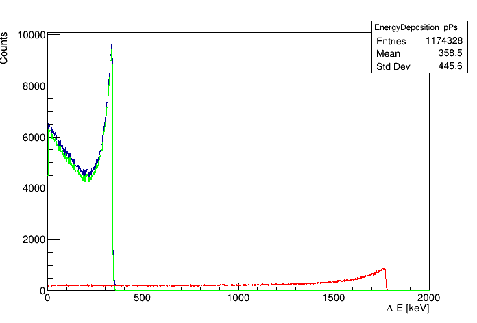
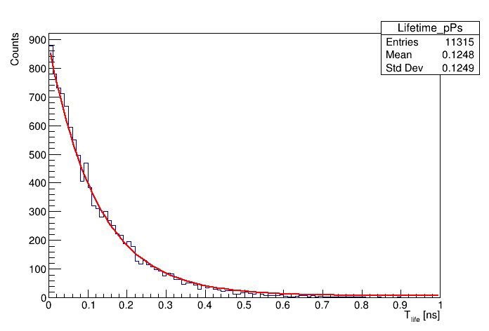
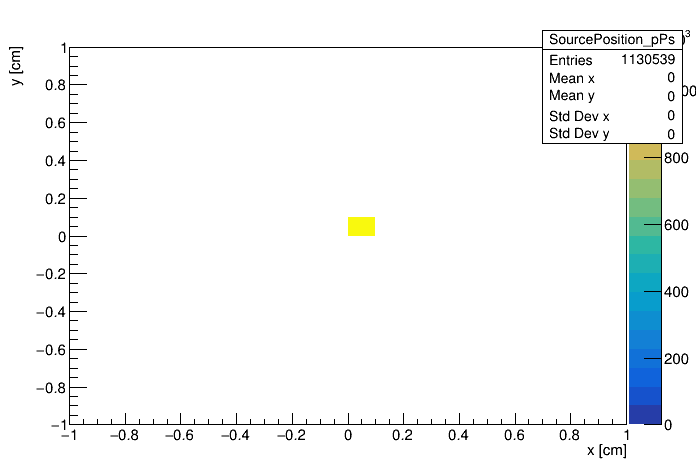

# Example 1

## About

This example includes:

* definition of the point source 

* two-photon emission from pPs decay

* emission of prompt gamma with fixed deexcitation energy (e.g. like in Scandium 44 or Sodium 22 sources)

## Additional information about macros

Because we want to focus only on Compton scattering without simulating electrons, only for presented examples we use unreal cuts:

`/gate/physics/Electron/SetCutInRegion  crystal1  1.0 cm`

`/gate/physics/Positron/SetCutInRegion  crystal1  1.0 cm`

Due to  those cuts the variable *edep* represents energy deposition during Compton scattering for gammas with energy higher than 511 keV.

## How to run example

To run both simulation and analysis just type:

```bash
bash run.sh
```

or if you want to rerun analysis type:
```bash
bash run.sh ONLY_ANALYSIS
```

## Results

All presented here results are generated by dedicated [program](../program/README.md)

### Energy deposition



This histogram contains the energy deposition in the detector:

* blue line - whole energy deposition spectrum

* red line - energy deposition from prompt gamma 

* green line - energy deposition from para-positronium annihilation photons


This histogram contains only the energy deposition from prompt gamma.

### Positronium lifetime



Calculated positronium lifetime based on data from a first hit of any annihilation photon and a prompt gamma ( blue line ).

Red curve represents fitted lifetime function f(t) for the fixed lifetime ( t0 = 0.1244 ns ) given by equation:

`f(t) = A*exp(-t/t0) + B`

### Source position



Reconstructed source position based on information from tracks.


