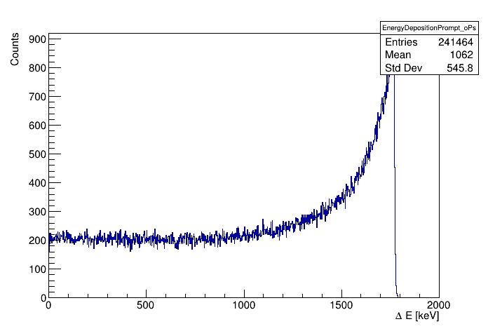
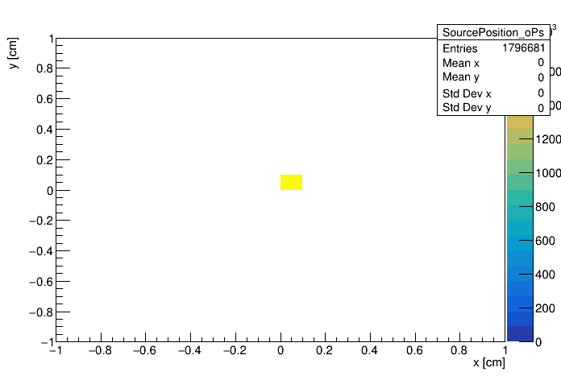
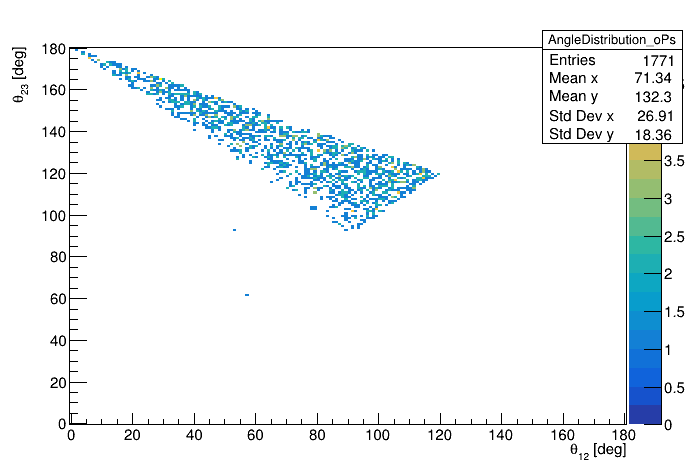
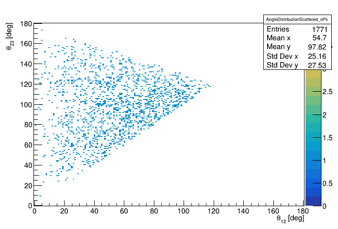

# Example 2

## About

This example includes:

* definition of point source

* three-photon emission from oPs decay

* emission of prompt gamma with fixed deexcitation energy (e.g. for Scandium 44 of Sodium 22 sources).

## Additional information about macros

Because we want to focus only on Compton scattering without simulating electrons, only for presented examples we use unreal cuts:

`/gate/physics/Electron/SetCutInRegion  crystal1  1.0 cm`

`/gate/physics/Positron/SetCutInRegion  crystal1  1.0 cm`

Due to those cuts variable *edep* represents energy deposition during Compton scattering for gammas with energy higher than 511 keV.

## How to run example

To run both simulation and analysis just type:

```bash
bash run.sh
```

or if you want to rerun analysis type:
```bash
bash run.sh ONLY_ANALYSIS
```

## Results

All presented here results are generated by the dedicated [program](../program/README.md)

### Energy deposition


This histogram presents the energy deposition in the detector:

* blue line - whole energy deposition spectrum

* red line - energy deposition from prompt gamma 

* green line - energy deposition from ortho-positronium annihilation gammas



This histogram represent only energy deposition from prompt gamma.

### Positronium lifetime


Calculated lifetime of positronium based on data from first hit of any annihilation photon and prompt gamma ( blue line ).

Red curve represents fitted lifetime function f(t) for fixed lifetime ( t0 = 138.6 ns ) given by equation:

`f(t) = A*exp(-t/t0) + B`

### Source position



Reconstructed source position based on information from tracks.

### Angles distribution

In both cases we take only events in which, each annihilation photon has scattered.

Detailed description of the histograms can be found in [this publication](https://arxiv.org/abs/1509.01114). 



Distribution of `o-Ps --> 3 gamma` events as function of theta12 and theta23 registered by the detector before the Compton scattering.



Distribution of `o-Ps --> 3 gamma` events as function of theta12 and theta23 registered by detector after the Compton scattering.

