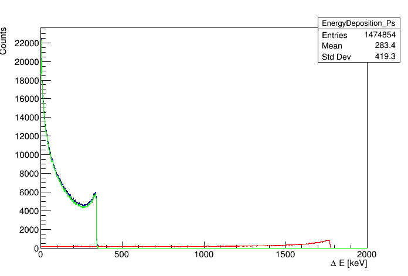
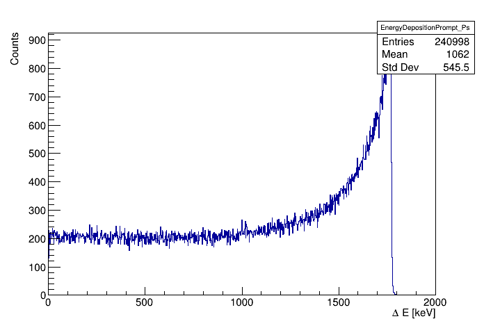
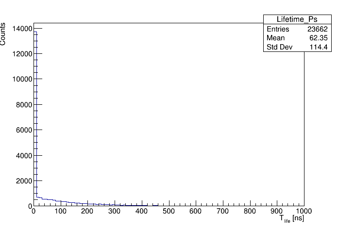

# Example 3
## About

This example includes:

* definition of the point source

* emission of photons from pPs decay ( with probability 60% ) and oPs decay ( with probability 40% )

* emission of prompt gamma with fixed deexcitation energy

## Additional information about macros

Because we want to focus only on Compton scattering without simulating electrons, only for presented examples we use unreal cuts:

`/gate/physics/Electron/SetCutInRegion  crystal1  1.0 cm`

`/gate/physics/Positron/SetCutInRegion  crystal1  1.0 cm`


## How to run example

To run both simulation and analysis just type:

```bash
bash run.sh
```

or if you want to rerun analysis type:
```bash
bash run.sh ONLY_ANALYSIS
```

## Results

All presented results are generated by the dedicated [program](../program/README.md)

### Energy deposition



This histogram presents energy deposition by photons in the detector:

* blue line - whole energy deposition spectrum

* red line - energy deposition from prompt gamma 

* green line - energy deposition from ortho-positronium and para-positronium annihilation gammas



This histogram represent only energy deposition from prompt gamma.

### Positronium lifetime



Calculated positronium lifetime based on data from first hit of any annihilation photon and the prompt gamma ( blue line ).

Because in this example we generate photons from pPs decay with probability 60% and from oPs decay with probability 40% there is significant signal for `t < 1 ns` from pPs and everything on the right is signal originating from the oPs decay.

### Source position


Reconstructed source position based on information from tracks.


